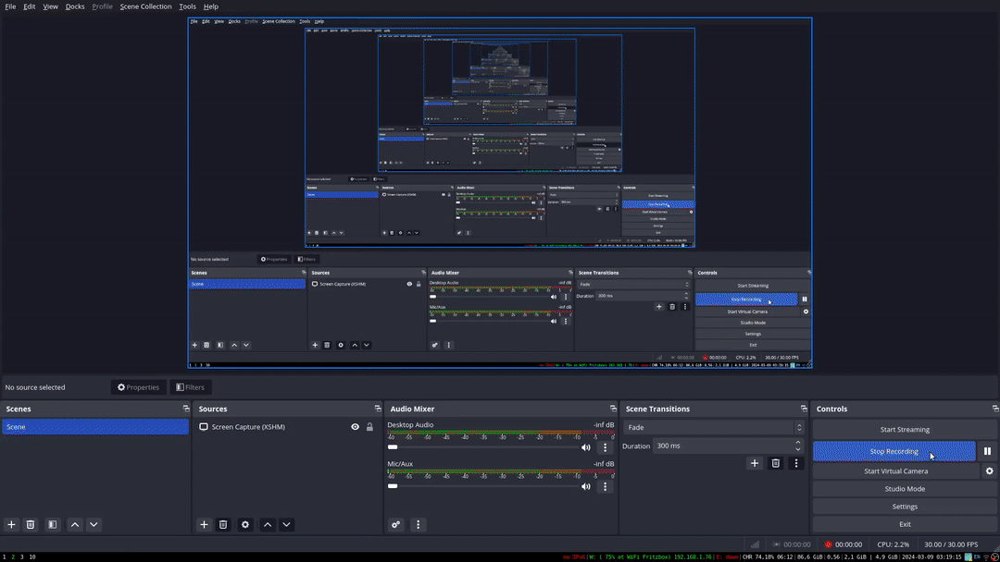
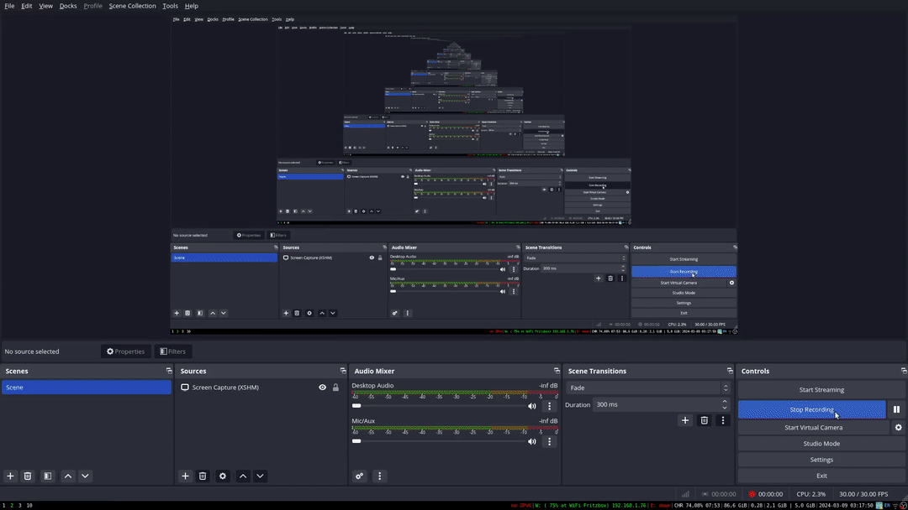
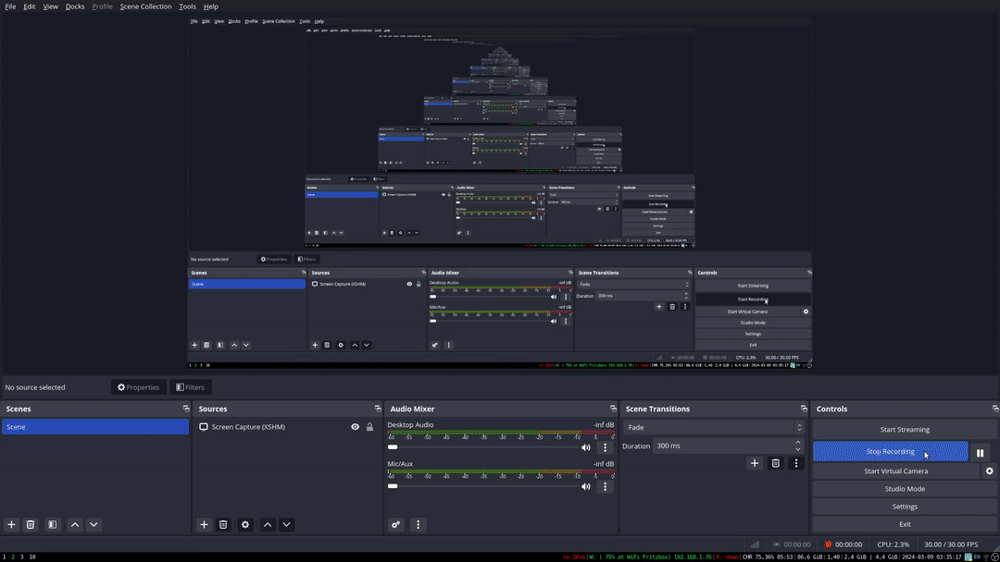
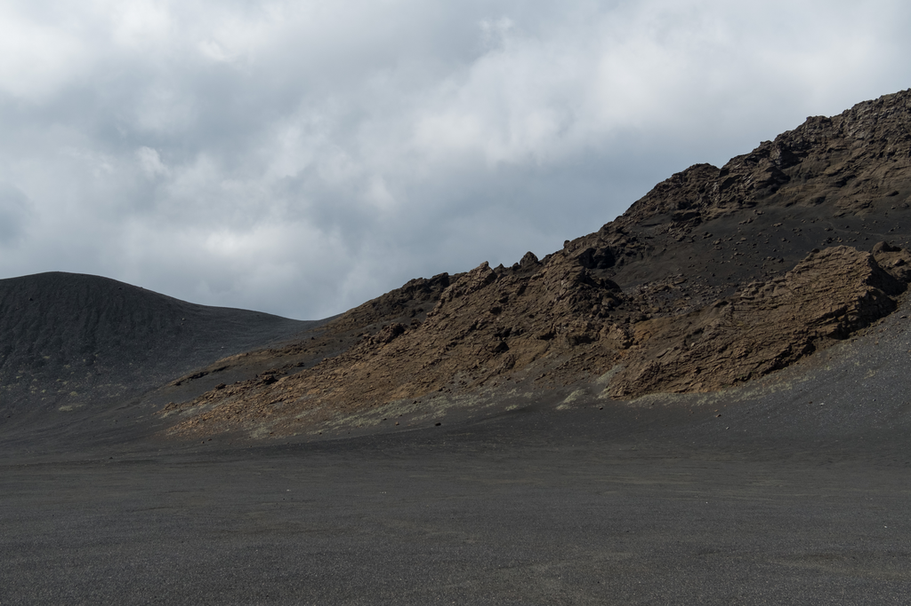

 

# Website: Annelotte Lammertse

## online@ [https://putteneersjoris.xyz/annelottelammertse](https://putteneersjoris.xyz/annelottelammertse)

## instructions: Annelotte


<details>
<summary>1: upload a project (Annelotte)</summary>
<br>
<ul>
<li>Please ensure that you are logged in to GitHub.</li>
<li>Go to the content directory: "src/content/".</li>
<li> upload your project as shown in the following video.<br>
<li></li>
<li>You have successfully uploaded a project. You can preview updates in 'Incognito mode' in your browser. Keep in mind that your browser caches content, so updates may be delayed for some time.</li>
</ul>
<br>
</details>


<details>
<summary>2: remove a project (Annelotte)</summary>
<br>
<ul>
<li>Please ensure that you are logged in to GitHub.</li>
<li>Go to the content directory: "src/content/".</li>
<li> remove your project as shown in the following video.<br>
<li></li>
<li>You have successfully removeed a project. You can preview updates in 'Incognito mode' in your browser. Keep in mind that your browser caches content, so updates may be delayed for some time.</li>
</ul>
<br>
</details>


<details>
<summary>3: update a project (Annelotte)</summary>
<br>
<ul>
<li>Please ensure that you are logged in to GitHub.</li>
<li>Go to the content directory: "src/content/".</li>
<li> update your project as shown in the following video.<br>
<li></li>
<li>You have successfully updateed a project. You can preview updates in 'Incognito mode' in your browser. Keep in mind that your browser caches content, so updates may be delayed for some time.</li>
</ul>
<br>
</details>


<details>
<summary>4: approve a project (Annelotte)</summary>
<br>
<ul>
<li>Please ensure that you are logged in to GitHub.</li>
<li>Go to the content directory: "src/content/".</li>
<li> approve your project as shown in the following video.<br>
<li></li>
<li>You have successfully approveed a project. You can preview updates in 'Incognito mode' in your browser. Keep in mind that your browser caches content, so updates may be delayed for some time.</li>
</ul>
<br>
</details>

 

## instructions: student

<details>
<summary><u> First setup (only once)</u></summary>
<br>
<ul>   
<li>1. Make sure you have a GitHub account: e.g: <a href="https://github.com/studentName">https://github.com/studentName</a></li>
<li>2. Fork the repository located under Annelotte's repository <a href="https://github.com/AnnelotteLammertse/annelottelammertse"> https://github.com/AnnelotteLammertse/annelottelammertse</a>.
<li></li>
</ul>
<br>
</details>


<details>
<summary>1: upload a project (student)</summary>
<br>
<ul>
<li>Please ensure that you are logged in to GitHub.</li>
<li>Go to your instance of Annelotte's website repository contentfolder: "src/content/" </li>
<li>Sync fork (this makes sure you have the latest version so there are no conflicts between other users).</li>
<li>Go to the content folder: (https://github.com/studentName/annelottelammertse/tree/main/src/content).</li>
<li> upload your project as shown in the following video.<br>
<li></li>
<li>Contribute by opening up a 'pull request > create pull request'.</li>
<li>Now Annelotte will get an email notification, as well as having an open pull request that can be approved or disapproved.</li>
<li>You now have successfully upload'ed a project. Once Annelotte approves of the changes, you can see your project on the official website.</li>
</ul>
<br>
</details>


<details>
<summary>2: remove a project (student)</summary>
<br>
<ul>
<li>Please ensure that you are logged in to GitHub.</li>
<li>Go to your instance of Annelotte's website repository contentfolder: "src/content/" </li>
<li>Sync fork (this makes sure you have the latest version so there are no conflicts between other users).</li>
<li>Go to the content folder: (https://github.com/studentName/annelottelammertse/tree/main/src/content).</li>
<li> remove your project as shown in the following video.<br>
<li></li>
<li>Contribute by opening up a 'pull request > create pull request'.</li>
<li>Now Annelotte will get an email notification, as well as having an open pull request that can be approved or disapproved.</li>
<li>You now have successfully remove'ed a project. Once Annelotte approves of the changes, you can see your project on the official website.</li>
</ul>
<br>
</details>


<details>
<summary>3: update a project (student)</summary>
<br>
<ul>
<li>Please ensure that you are logged in to GitHub.</li>
<li>Go to your instance of Annelotte's website repository contentfolder: "src/content/" </li>
<li>Sync fork (this makes sure you have the latest version so there are no conflicts between other users).</li>
<li>Go to the content folder: (https://github.com/studentName/annelottelammertse/tree/main/src/content).</li>
<li> update your project as shown in the following video.<br>
<li></li>
<li>Contribute by opening up a 'pull request > create pull request'.</li>
<li>Now Annelotte will get an email notification, as well as having an open pull request that can be approved or disapproved.</li>
<li>You now have successfully update'ed a project. Once Annelotte approves of the changes, you can see your project on the official website.</li>
</ul>
<br>
</details>
 
## demoproject
In the following section a demoproject is provided.This includes images and a description file. You can the coresponding files <a href="https://github.com/putteneersjoris/annelottelammertse/tree/main/example/demoproject">here</a>

 
```bash
demoproject file tree:

├── project_name
│ ├── 1.jpg
│ ├── 2.jpg
│ ├── 3.jpg
│ ├── 4.jpg
│ ├── 5.jpg
│ └── description.txt

```
 

### images

- Images can be of `.jpg`, `.png`, `.gif`, `.HEIC` format.
- The max image filezize is 10mb.
- the max resolution is 5000x5000 pixels

<div style="display: flex; flex-wrap: wrap;">
    
    
    
</div>

 

### description

- You can only have 1 description. You can upload more but only alphabetically first one will be read.
-  It can have filenames with spaces, and characters.
-  word, or other office documents or any other word processor is not supported. it can only have a .txt file extension. 
-  Every `.txt` file in every project should have 4 tags. `<title></title>`, `<date>,</date>`, `<body></body>`, `<tags></tags>`:

They can be used like this:

```html
<title>Project 1</title> <!-- PROJECTTITLE-->
<date>10/10/2024</date> <!-- PROJECDATE-->
<tags>textile, bioactive, healthcare, wound healing</tags> <!-- TAGS, SEPERATED BY COMMA-->
<body> <!-- MAIN TEXT-->
    <h2>Project Overview</h2> <!-- SUBTITLE-->
    This project focuses on the development of bioactive textiles for applications in wound healing and healthcare. By incorporating bioactive agents into textile fibers, we aim to create functional textiles capable of promoting wound healing, preventing infections, and improving overall healthcare outcomes. The project involves a multidisciplinary approach that combines textile engineering, biomaterials science, and medical research to design innovative solutions for medical textiles.
    The use of bioactive textiles has the potential to revolutionize wound care by providing continuous, localized delivery of therapeutic agents directly to the wound site. This targeted delivery system minimizes systemic side effects and enhances the efficacy of treatment. Additionally, bioactive textiles offer advantages such as improved patient comfort, reduced dressing changes, and simplified wound management procedures.  

    The research objectives of the project include investigating methods for functionalizing textile fibers with bioactive agents, optimizing the release kinetics of therapeutic compounds, and evaluating the biocompatibility and safety of bioactive textiles for clinical use. Advanced fabrication techniques such as electrospinning, coating, and grafting will be employed to incorporate bioactive agents into textile matrices while preserving their structural integrity and mechanical properties.

    <details><summary>Click for more details</summary>This section contains additional details about the project.<!-- EXPANDIBLE SECTION-->
	    <a href="https://www.sciencedirect.com/science/article/pii/S014296121830642X">Read this paper</a> <!-- LINKS-->
	    <a href="https://www.ncbi.nlm.nih.gov/pmc/articles/PMC5799424/">Explore this study</a>
	    <a href="https://www.frontiersin.org/articles/10.3389/fbioe.2020.587592/full">Find out more</a> about advanced fabrication techniques for bioactive textiles.</details>
    <details><summary>Click for more details</summary>This section contains additional details about the project.</details>

    <p>The expected outcomes of the project include the development of bioactive textiles with tailored properties for specific medical applications, such as wound dressings, compression garments, and implantable devices. These innovative textiles have the potential to improve patient outcomes, reduce healthcare costs, and advance the field of regenerative medicine.</p><!-- PROJECT PARAGRAPH-->
</body>
```
 
 

## navigation

 

## code

Every push request activates a github actions protocal  that:

- installs:
    - imagemagick for image processing
-  generates:
    - the static .html webpages for every project.
    - the data.js file that is needed for script.js
- uploads:
    - script.js
    - index.html


<details  open ><summary>0: default.yaml</summary>

```
name: default
on:
  push:
    branches:
      - main
jobs:
  publish:
    runs-on: ubuntu-latest
    steps:
      - name: Checkout
        uses: actions/checkout@v3
      - name: Set up ImageMagick
        run: |
          sudo apt-get update
          sudo apt-get install -y imagemagick
      - name: Update imagemagick rights Policy
        run: |
          sudo sed -i 's#<policy domain="path" rights="none" pattern="@\*"/>#<!-- <policy domain="path" rights="none" pattern="@*"/> -->#' /etc/ImageMagick-6/policy.xml
      - name: python generate data.js and html pages
        working-directory: src/
        run: python ./generateData.py
      - name: Deploy to Github Pages
        uses: crazy-max/ghaction-github-pages@v3
        with:
          target_branch: gh-pages
          build_dir: src
        env:
          GITHUB_TOKEN: ${{ secrets.GITHUB_TOKEN }}

```
</details>


<details ><summary>1: index.html</summary>

```
<!DOCTYPE html>
<html lang="en">
<head>
    <meta charset="UTF-8">
    <meta http-equiv="X-UA-Compatible" content="IE=edge">
    <meta name="viewport" content="width=device-width, initial-scale=1.0">
    <title>Annelotte</title>
    <link rel="stylesheet" href="style.css">
</head>

<body>
	<span id="tags-wrapper"></span> <!-- set tags here > -->
	<div id="header">
		<div id="title">
			<h1><a href="./index.html" style="color: black; text-decoration: none;">Annelotte Lammertse</a></h1>
		</div>
		<div id="bar">
			<div id="barContent"></div> <!-- set bar content projects here > -->
		</div>
		 <div id="content">
			<div id="projects"></div>
		</div>
	</div>
	<div id="footer">
		<span> Annelotte Lammertse </span><span id="footerTextRight"></span>
	</div>
</body>

<script src="data.js"></script> 
<script src="script.js"></script> 
</html>


```
</details>


<details ><summary>2: staticHtmlString.py</summary>

```
def html_string(folderName, project_date, previous_htmlFile, next_htmlFile, tag_string, project_html, images_html, num_images):
    project_html_content = f"""
<!DOCTYPE html>
<html lang="en">
<head>
    <meta charset="UTF-8">
    <meta http-equiv="X-UA-Compatible" content="IE=edge">
    <meta name="viewport" content="width=device-width, initial-scale=1.0">
    <title>Annelotte Lammertse</title>
    <link rel="stylesheet" href="./style.css">
</head>
<body>
    <span id="tags-wrapper"></span> <!-- set tags here > -->
    <div id="header">
        <div id="title">
            <h1>
                <a href="./index.html" style="color: black; text-decoration: none;">Annelotte Lammertse</a>
            </h1>
        </div>
        <div id="bar">
            <div id="barContent"></div> <!-- set bar content projects here > -->
        </div>
        <div id="contentPage">
            <div id="textPage">
                <h1>{folderName} <br><span style="font-size:14px">{project_date}</span></h1>  <!-- add back, next, and menu buttons here -->
                <div class="containerStatic">
                    <div class="menuprevnext">
                        <span>
                            <a href='./index.html' class='backButtonPage'> menu</a>
                        </span>
                        <br>
                        <span>
                            <a href='{previous_htmlFile}' class='backButtonPage'>previous</a>
                        </span>
                        <br>
                        <span>
                            <a href= '{next_htmlFile}' class='backButtonPage'>next</a>
                        </span>
                    </div>
                    <span id="tagStatic" style="color:rgb(0,0,0);">
                        {tag_string}
                    </span>
                </div>
                <body>
                    <p>{project_html}</p>  <!-- body text here -->
                </body>
            </div>
            <div id="imagePage"> <!-- add all images here -->
                {images_html}
            </div>
        </div>
        <div id="footer">
            <span> Annelotte Lammertse </span>
            <span id="footerTextRight"></span>
        </div>
    </div>
</body>

<script src="data.js"></script> 
<script src="script.js"></script> 

<script>
    document.addEventListener('DOMContentLoaded', function () {{
        // Apply fullscreen styles to images if less than 4 on startup; toggle on click otherwise
        const images = document.querySelectorAll('.imagesPage');
        images.forEach((img, index) => {{
            img.addEventListener('click', () => {{
                img.classList.toggle('imagePageFull');
                img.style.width = img.classList.contains('imagePageFull') ? "100%" : "32.8%";
            }});

            if (images.length < {num_images}) {{
                img.classList.add('imagePageFull');
                img.style.width = "100%";
            }} else if (images.length > {num_images} && index == 0) {{
                img.classList.add('imagePageFull');
                img.style.width = "100%";
            }}
        }});

        // Make the tags that are present red
        var tagsWrapper = document.getElementById('tags-wrapper');
        var tagStaticElements = document.getElementById('tagStatic').getElementsByTagName('span');
        var innerTagArray = [];
        for (var i = 0; i < tagStaticElements.length; i++) {{
            innerTagArray.push(tagStaticElements[i].innerHTML.replace('#', ''));
        }}

        var tags = tagsWrapper.getElementsByTagName('span');
        for (var i = 0; i < tags.length; i++) {{
            var dataFilter = tags[i].getAttribute('data-filter');
            if (innerTagArray.includes(dataFilter)) {{
                tags[i].style.pointerEvents = 'none';
                //tags[i].style.textDecoration = 'underline';
            }} else {{
                tags[i].style.color = 'rgba(0,0,0,0.1)'
                tags[i].style.textDecoration = 'line-through';
            }}
        }}
    }});
</script>
</html>
"""

    return project_html_content

```
</details>


<details ><summary>3: generateData.py</summary>

```
import os
import json
import re
import subprocess
import math
from staticHtmlString import html_string

contentFolder = "./content"  # Specify the folder where your content is located
outputFolder = "./"     # Specify the folder where you want to save the HTML files
max_bytes =math.floor( 0.1 * 1048576) # 5mb
processed_addition = "__processed"
approved_extensions = ("jpg", "png", "jpeg", "txt", "gif", "heic")

# Functions

def decompose_file(file_path):
	parts = file_path.rsplit("/", 1)
	directory = parts[0]
	filename_with_extension = parts[1]
	filename_without_extension, extension = filename_with_extension.split(".", 1)
	
	return directory, filename_with_extension, filename_without_extension, extension


def rename_file(file_path):
	#replace spaces in file with _
	directory, filename_with_extension=  decompose_file(file_path)[:2]
	file_no_spaces = os.path.join( directory, filename_with_extension.replace(" ", "_").replace("(","_").replace(")","_").replace("{","_").replace("}","_") )
	os.rename( file_path , file_no_spaces )

	return file_no_spaces


def rename_file_processed(file_path):
	#if file has good res and size, we can rename it to __processed
	directory, filename_with_extension, filename_without_extension, extension=  decompose_file(file_path)
	file_processed = os.path.join( directory, filename_without_extension + processed_addition  + "." + extension  )
	os.rename( file_path , file_processed)

def remove_unsupported_file(file_path):
	extension=  decompose_file(file_path)[-1]
	if extension.lower() not in approved_extensions:
		os.remove(file_path)
		print(f'{file_path} is not supported and has been removed.')
		return True
	else:
		return False


def process_images(file_path):
	optional_args = ""
	processed_extension = ""
	
	extension = decompose_file(file_path)[-1]

	if extension.lower() == "heic":
		processed_extension = "png"
		optional_args = "-resize '1024x>' -quality 80"

	if extension.lower() == "gif":
		processed_extension = "gif"
		optional_args = "-resize '512x>' -quality 80"

	if extension.lower() in ("png", "jpg", "jpeg", "jpeg"):
		processed_extension = "png"
		optional_args = "-resize '1024x>' -quality 80"
	
	return optional_args, processed_extension


def process_files(file_path, max_bytes):
		
	if remove_unsupported_file(file_path):
		return

	directory, filename_with_extension, filename_without_extension, extension = decompose_file(file_path)

	if extension != "txt":
		if processed_addition  in filename_without_extension:
			return
		
		file_size = os.path.getsize(file_path)
		
		if file_size >= max_bytes:

			optional_args,processed_extension = process_images(file_path) 
			
			file_path_reconstructed = f"{directory}/{filename_without_extension}.{extension}"
			file_dir_reconstructed = f"{directory}/"
			
			command  = f"convert \"{file_path_reconstructed}\" {optional_args} -set filename:base '%[basename]' \"{file_dir_reconstructed}%[filename:base]_{processed_addition}.{processed_extension}\""
			
			subprocess.run(command, shell=True)
			
			os.remove(file_path) #remove original file afterwards
			
		else:
			rename_file_processed(file_path)


##process images
for folder in os.listdir(contentFolder):
	folder_path = os.path.join(contentFolder, folder)
	if os.path.isdir(folder_path):
		for file in os.listdir(folder_path):
			file_path = os.path.join(folder_path, file)
			process_files(rename_file(file_path), max_bytes)


#process .txt file to html

#cleanup first
# Delete all .html files (excluding index.html) in the output folder
for filename in os.listdir(outputFolder):
	filepath = os.path.join(outputFolder, filename)
	if filename.endswith(".html") and filename != "index.html":
		os.remove(filepath)
  

# Initialize arrays for images, tags, date, projects, allTags, and barContent
images = []
tags = []
date = []
projects = {}
allTags = []
barContent = []
htmlFiles = []

# make array with all projectnames
for folderName in os.listdir(contentFolder):
	folderPath = os.path.join(contentFolder, folderName)
	htmlFiles.append(folderName)

sorted_htmlFiles = sorted(htmlFiles)

# Iterate through the content folder
for i,folderName in enumerate(sorted(os.listdir(contentFolder))):
	# loop through sorted html_files so we can pick i+1 and i-1 fo to back and fort
	next_index = (i + 1) % len(sorted_htmlFiles)
	next_htmlFile = "./" + sorted_htmlFiles[next_index] + ".html"
	previous_index = (i - 1) % len(sorted_htmlFiles)
	previous_htmlFile = "./" + sorted_htmlFiles[previous_index] + ".html"

	folderPath = os.path.join(contentFolder, folderName)
	if os.path.isdir(folderPath):
		project_images = []
		project_tags = []
		project_date = []
		project_html = ""


		for item in os.listdir(folderPath):
			itemPath = os.path.join(folderPath, item)

			if os.path.isfile(itemPath):
				#if item.endswith(".gif"):
					#images.append(itemPath)
					#project_images.append(itemPath)

				if item.endswith((".jpg", ".png", ".heic", ".gif")):
					#itemPath_base = os.path.splitext(os.path.basename(itemPath))[0]
					#itemPath_ext = os.path.splitext(os.path.basename(itemPath))[1]
					#itemPath_resized = os.path.join(folderPath,itemPath_base + "_resized" + itemPath_ext)
					#os.system(f'convert "{itemPath}"  -sharpen 0x.2 -resize x350 "{itemPath}"')
					images.append(itemPath)
					project_images.append(itemPath)

				elif item.endswith(".txt"):
					with open(itemPath, 'r') as txt_file:
						content = txt_file.read()
						date_match = re.search(r'<date>(.*?)<\/date>', content, re.DOTALL)
						if date_match:
							project_date.append(date_match.group(1).strip())
							project_date = date_match.group(1).strip()
						body_match = re.search(r'<body>(.*?)<\/body>', content, re.DOTALL)
						if body_match:
							project_html = body_match.group(1).strip()
							project_html = project_html.replace('\n', '<br>')
                        
						tags_match = re.search(r'<tags>(.*?)<\/tags>', content, re.DOTALL)
						if tags_match:
							tags_content = tags_match.group(1).strip()
							tags_formatted = ["#" + tag.strip() + "<br>" for tag in tags_content.split(',')]
							allTags.extend([
								"<span class='filter' data-filter='" + tag.strip() + "'>#" + tag.strip() + "</span>"
								for tag in tags_content.split(',')
							])
							# print(allTags)
					#break out of the loop after procvessing the first file
					break

		tag_list = [f"<span>#{tag.strip()}</span><br>" for tag in tags_content.split(",")]
		tag_string = "".join(tag_list)
		project_tags.append(tag_string)
		# print(project_tags)           
                
		project_images.sort()  # Sort the image paths for the current project
        
		projects[folderName] = {
			"images": project_images,
			"html": project_html,
			"tags": project_tags,
			"date": project_date
		}
        
		#print(tags_content)

		# Create a project HTML file with images and barContent links
		images_html = "\n".join([f"" for image_path in project_images])
		num_images =3	
		
		#html string comes from staticHtmlString
		project_html_content = html_string(folderName, project_date, previous_htmlFile, next_htmlFile, tag_string, project_html, images_html, num_images)


		project_html_path = os.path.join(outputFolder, f"{folderName}.html")
		with open(project_html_path, 'w') as project_html_file:
			project_html_file.write(project_html_content)

allTags = list(set(allTags))
allTags.sort()

# Sort the project names
sorted_project_names = sorted(projects.keys())

# Create the barContent array with formatted project names
formatted_barContent = [
	"<a href='./" + project_name + ".html'>" + project_name + "</a>&ensp;&ensp;"
	for project_name in sorted_project_names
]

# Duplicate the formatted_barContent array 10 times
duplicated_barContent = formatted_barContent * 10

# Create the content dictionary with sorted projects
sorted_projects = {project_name: projects[project_name] for project_name in sorted_project_names}

# Create the content dictionary
content = {
	"projects": sorted_projects,
	"allTags": allTags,
	"barContent": duplicated_barContent
}

# Convert the content dictionary to JSON format
content_json = json.dumps(content, indent=4)

# Write the JSON content to a file named "dataB.js"
with open("data.js", "w") as file:
	file.write("var content = ")
	file.write(content_json)

print("File 'data.js' saved successfully.")


```
</details>


<details ><summary>4: data.js</summary>

```
var content = {
    "projects": {
        "Black ash desert": {
            "images": [
                "./content/Black ash desert/BLACK_ASH_DESERT_246___processed.png",
                "./content/Black ash desert/BLACK_ASH_DESERT_255___processed.png",
                "./content/Black ash desert/BLACK_ASH_DESERT_257___processed.png",
                "./content/Black ash desert/BLACK_ASH_DESERT_259___processed.png"
            ],
            "html": "<h2>Project Overview</h2><br>This project focuses on addressing the environmental impact of traditional textile dyeing processes by developing sustainable dyeing techniques using natural pigments and eco-friendly processes. By reducing the use of harmful chemicals and minimizing water consumption, we aim to promote environmental sustainability in the textile industry.<br>    <br><h3>Expected Outcomes</h3><br>The project aims to provide textile manufacturers with sustainable alternatives to conventional dyeing methods. By utilizing natural pigments and eco-friendly processes, we anticipate reducing water consumption, minimizing pollution, and promoting biodiversity conservation. Additionally, textiles dyed using sustainable techniques are expected to appeal to environmentally conscious consumers, driving market demand for eco-friendly products.",
            "tags": [
                "<span>#container</span><br><span>#hongKong</span><br><span>#street</span><br><span>#photography</span><br>"
            ],
            "date": "1/4/2025"
        },
        "Iceland red rock": {
            "images": [
                "./content/Iceland red rock/BLACK_ASH_DESERT_162___processed.png",
                "./content/Iceland red rock/BLACK_ASH_DESERT_183___processed.png"
            ],
            "html": "<h2>Project Overview</h2><br>This project focuses on addressing the environmental impact of traditional textile dyeing processes by developing sustainable dyeing techniques using natural pigments and eco-friendly processes. By reducing the use of harmful chemicals and minimizing water consumption, we aim to promote environmental sustainability in the textile industry.<br>    <br><h3>Expected Outcomes</h3><br>The project aims to provide textile manufacturers with sustainable alternatives to conventional dyeing methods. By utilizing natural pigments and eco-friendly processes, we anticipate reducing water consumption, minimizing pollution, and promoting biodiversity conservation. Additionally, textiles dyed using sustainable techniques are expected to appeal to environmentally conscious consumers, driving market demand for eco-friendly products.",
            "tags": [
                "<span>#iceland</span><br><span>#green</span><br><span>#red</span><br><span>#rock</span><br><span>#nature</span><br><span>#photography</span><br>"
            ],
            "date": "11/2/1999"
        },
        "about me": {
            "images": [
                "./content/about me/DSC_0018___processed.png",
                "./content/about me/DSC_0021___processed.png",
                "./content/about me/DSC_0047___processed.png",
                "./content/about me/DSC_0058___processed.png"
            ],
            "html": "<h2>Project Overview</h2><br>This project focuses on addressing the environmental impact of traditional textile dyeing processes by developing sustainable dyeing techniques using natural pigments and eco-friendly processes. By reducing the use of harmful chemicals and minimizing water consumption, we aim to promote environmental sustainability in the textile industry.<br>    <br><h3>Expected Outcomes</h3><br>The project aims to provide textile manufacturers with sustainable alternatives to conventional dyeing methods. By utilizing natural pigments and eco-friendly processes, we anticipate reducing water consumption, minimizing pollution, and promoting biodiversity conservation. Additionally, textiles dyed using sustainable techniques are expected to appeal to environmentally conscious consumers, driving market demand for eco-friendly products.",
            "tags": [
                "<span>#about me</span><br><span>#photography</span><br><span>#travel</span><br>"
            ],
            "date": "11/2/2003"
        },
        "birds nest": {
            "images": [
                "./content/birds nest/SHIPYARD_61___processed.png",
                "./content/birds nest/SHIPYARD_62___processed.png"
            ],
            "html": "<h2>Project Overview</h2><br>This project focuses on addressing the environmental impact of traditional textile dyeing processes by developing sustainable dyeing techniques using natural pigments and eco-friendly processes. By reducing the use of harmful chemicals and minimizing water consumption, we aim to promote environmental sustainability in the textile industry.<br>    <br><h3>Expected Outcomes</h3><br>The project aims to provide textile manufacturers with sustainable alternatives to conventional dyeing methods. By utilizing natural pigments and eco-friendly processes, we anticipate reducing water consumption, minimizing pollution, and promoting biodiversity conservation. Additionally, textiles dyed using sustainable techniques are expected to appeal to environmentally conscious consumers, driving market demand for eco-friendly products.",
            "tags": [
                "<span>#birds</span><br><span>#container</span><br><span>#rust</span><br><span>#red</span><br><span>#small</span><br>"
            ],
            "date": "10/2/2021"
        },
        "containers": {
            "images": [
                "./content/containers/Shipping_Containers__85____processed.png",
                "./content/containers/Shipping_Containers__87____processed.png"
            ],
            "html": "<h2>Project Overview</h2><br>This project focuses on addressing the environmental impact of traditional textile dyeing processes by developing sustainable dyeing techniques using natural pigments and eco-friendly processes. By reducing the use of harmful chemicals and minimizing water consumption, we aim to promote environmental sustainability in the textile industry.<br>    <br><h3>Expected Outcomes</h3><br>The project aims to provide textile manufacturers with sustainable alternatives to conventional dyeing methods. By utilizing natural pigments and eco-friendly processes, we anticipate reducing water consumption, minimizing pollution, and promoting biodiversity conservation. Additionally, textiles dyed using sustainable techniques are expected to appeal to environmentally conscious consumers, driving market demand for eco-friendly products.",
            "tags": [
                "<span>#container</span><br><span>#hongKong</span><br><span>#street</span><br><span>#photography</span><br><span>#color</span><br><span>#red</span><br>"
            ],
            "date": "11/3/2022"
        },
        "demoproject": {
            "images": [
                "./content/demoproject/HOT_SPRINGS_094___processed.png",
                "./content/demoproject/demoproject_2___processed.png",
                "./content/demoproject/placeholder___processed.png"
            ],
            "html": "<h2>Project Overview</h2><br>extra text here<br>This project focuses onadd some text  impact of traditional textile dyeing processes by developing sustainable dyeing techniques using natural pigments and eco-friendly processes. By reducing the use of harmful chemicals and minimizing water consumption, we aim to promote environmental sustainability in the textile industry.<br>    <br><h3>Expected Outcomes</h3><br>The project aims to provide textile manufacturers with sustainable alternatives to conventional dyeing methods. By utilizing natural pigments and eco-friendly processes, we anticipate reducing water consumption, minimizing pollution, and promoting biodiversity conservation. Additionally, textiles dyed using sustainable techniques are expected to appeal to environmentally conscious consumers, driving market demand for eco-friendly products.",
            "tags": [
                "<span>#container</span><br><span>#water</span><br><span>#heat</span><br><span>#desert</span><br><span>#photography</span><br>"
            ],
            "date": "11/2/1999"
        },
        "fountain": {
            "images": [
                "./content/fountain/HOT_SPRINGS_092___processed.png",
                "./content/fountain/HOT_SPRINGS_094___processed.png",
                "./content/fountain/HOT_SPRINGS_095___processed.png"
            ],
            "html": "<h2>Project Overview</h2><br>This project focuses on addressing the environmental impact of traditional textile dyeing processes by developing sustainable dyeing techniques using natural pigments and eco-friendly processes. By reducing the use of harmful chemicals and minimizing water consumption, we aim to promote environmental sustainability in the textile industry.<br>    <br><h3>Expected Outcomes</h3><br>The project aims to provide textile manufacturers with sustainable alternatives to conventional dyeing methods. By utilizing natural pigments and eco-friendly processes, we anticipate reducing water consumption, minimizing pollution, and promoting biodiversity conservation. Additionally, textiles dyed using sustainable techniques are expected to appeal to environmentally conscious consumers, driving market demand for eco-friendly products.",
            "tags": [
                "<span>#container</span><br><span>#water</span><br><span>#heat</span><br><span>#desert</span><br><span>#photography</span><br>"
            ],
            "date": "11/2/1999"
        },
        "greenland mountainscape": {
            "images": [
                "./content/greenland mountainscape/BLACK_ASH_DESERT_001___processed.png",
                "./content/greenland mountainscape/BLACK_ASH_DESERT_002___processed.png",
                "./content/greenland mountainscape/BLACK_ASH_DESERT_003___processed.png",
                "./content/greenland mountainscape/BLACK_ASH_DESERT_004___processed.png",
                "./content/greenland mountainscape/BLACK_ASH_DESERT_005___processed.png",
                "./content/greenland mountainscape/BLACK_ASH_DESERT_007___processed.png",
                "./content/greenland mountainscape/BLACK_ASH_DESERT_008___processed.png",
                "./content/greenland mountainscape/BLACK_ASH_DESERT_012___processed.png",
                "./content/greenland mountainscape/BLACK_ASH_DESERT_014___processed.png",
                "./content/greenland mountainscape/BLACK_ASH_DESERT_016___processed.png"
            ],
            "html": "<h2>Project Overview</h2><br>This project focuses on addressing the environmental impact of traditional textile dyeing processes by developing sustainable dyeing techniques using natural pigments and eco-friendly processes. By reducing the use of harmful chemicals and minimizing water consumption, we aim to promote environmental sustainability in the textile industry.<br>    <br><h3>Expected Outcomes</h3><br>The project aims to provide textile manufacturers with sustainable alternatives to conventional dyeing methods. By utilizing natural pigments and eco-friendly processes, we anticipate reducing water consumption, minimizing pollution, and promoting biodiversity conservation. Additionally, textiles dyed using sustainable techniques are expected to appeal to environmentally conscious consumers, driving market demand for eco-friendly products.",
            "tags": [
                "<span>#greenland</span><br><span>#nature</span><br><span>#travel photography</span><br>"
            ],
            "date": "11/2/1999"
        },
        "hot springs": {
            "images": [
                "./content/hot springs/HOT_SPRINGS_052___processed.png"
            ],
            "html": "<h2>Project Overview</h2><br>This project focuses on addressing the environmental impact of traditional textile dyeing processes by developing sustainable dyeing techniques using natural pigments and eco-friendly processes. By reducing the use of harmful chemicals and minimizing water consumption, we aim to promote environmental sustainability in the textile industry.<br>    <br><h3>Expected Outcomes</h3><br>The project aims to provide textile manufacturers with sustainable alternatives to conventional dyeing methods. By utilizing natural pigments and eco-friendly processes, we anticipate reducing water consumption, minimizing pollution, and promoting biodiversity conservation. Additionally, textiles dyed using sustainable techniques are expected to appeal to environmentally conscious consumers, driving market demand for eco-friendly products.",
            "tags": [
                "<span>#water</span><br><span>#desert</span><br><span>#nature</span><br><span>#photography</span><br>"
            ],
            "date": "11/2/1999"
        },
        "indiana desert": {
            "images": [
                "./content/indiana desert/HOT_SPRINGS_011___processed.png",
                "./content/indiana desert/HOT_SPRINGS_027___processed.png",
                "./content/indiana desert/HOT_SPRINGS_039___processed.png",
                "./content/indiana desert/HOT_SPRINGS_045___processed.png"
            ],
            "html": "<h2>Project Overview</h2><br>This project focuses on addressing the environmental impact of traditional textile dyeing processes by developing sustainable dyeing techniques using natural pigments and eco-friendly processes. By reducing the use of harmful chemicals and minimizing water consumption, we aim to promote environmental sustainability in the textile industry.<br>    <br><h3>Expected Outcomes</h3><br>The project aims to provide textile manufacturers with sustainable alternatives to conventional dyeing methods. By utilizing natural pigments and eco-friendly processes, we anticipate reducing water consumption, minimizing pollution, and promoting biodiversity conservation. Additionally, textiles dyed using sustainable techniques are expected to appeal to environmentally conscious consumers, driving market demand for eco-friendly products.",
            "tags": [
                "<span>#nature</span><br><span>#desert</span><br><span>#indiana</span><br><span>#water</span><br><span>#photography</span><br>"
            ],
            "date": "11/2/1999"
        },
        "photopack": {
            "images": [
                "./content/photopack/BLACK_ASH_DESERT_072___processed.png",
                "./content/photopack/BLACK_ASH_DESERT_118___processed.png",
                "./content/photopack/BLACK_ASH_DESERT_190___processed.png",
                "./content/photopack/BLACK_ASH_DESERT_215___processed.png",
                "./content/photopack/BLACK_ASH_DESERT_216___processed.png"
            ],
            "html": "<h2>Project Overview</h2><br>This project focuses on addressing the environmental impact of traditional textile dyeing processes by developing sustainable dyeing techniques using natural pigments and eco-friendly processes. By reducing the use of harmful chemicals and minimizing water consumption, we aim to promote environmental sustainability in the textile industry.<br>    <br><h3>Expected Outcomes</h3><br>The project aims to provide textile manufacturers with sustainable alternatives to conventional dyeing methods. By utilizing natural pigments and eco-friendly processes, we anticipate reducing water consumption, minimizing pollution, and promoting biodiversity conservation. Additionally, textiles dyed using sustainable techniques are expected to appeal to environmentally conscious consumers, driving market demand for eco-friendly products.",
            "tags": [
                "<span>#desert</span><br><span>#black</span><br><span>#iceland</span><br><span>#photography</span><br>"
            ],
            "date": "11/2/1999"
        },
        "seabad": {
            "images": [
                "./content/seabad/SHIPYARD_11___processed.png",
                "./content/seabad/SHIPYARD_12___processed.png"
            ],
            "html": "<h2>Project Overview</h2><br>This project focuses on addressing the environmental impact of traditional textile dyeing processes by developing sustainable dyeing techniques using natural pigments and eco-friendly processes. By reducing the use of harmful chemicals and minimizing water consumption, we aim to promote environmental sustainability in the textile industry.<br>    <br><h3>Expected Outcomes</h3><br>The project aims to provide textile manufacturers with sustainable alternatives to conventional dyeing methods. By utilizing natural pigments and eco-friendly processes, we anticipate reducing water consumption, minimizing pollution, and promoting biodiversity conservation. Additionally, textiles dyed using sustainable techniques are expected to appeal to environmentally conscious consumers, driving market demand for eco-friendly products.",
            "tags": [
                "<span>#container</span><br><span>#shipping</span><br><span>#sea</span><br><span>#photography</span><br>"
            ],
            "date": "11/2/1999"
        },
        "shipwreck": {
            "images": [
                "./content/shipwreck/asd___processed.png"
            ],
            "html": "<h2>Project Overview</h2><br>This project focuses on addressing the environmental impact of traditional textile dyeing processes by developing sustainable dyeing techniques using natural pigments and eco-friendly processes. By reducing the use of harmful chemicals and minimizing water consumption, we aim to promote environmental sustainability in the textile industry.<br>    <br><h3>Expected Outcomes</h3><br>The project aims to provide textile manufacturers with sustainable alternatives to conventional dyeing methods. By utilizing natural pigments and eco-friendly processes, we anticipate reducing water consumption, minimizing pollution, and promoting biodiversity conservation. Additionally, textiles dyed using sustainable techniques are expected to appeal to environmentally conscious consumers, driving market demand for eco-friendly products.",
            "tags": [
                "<span>#container</span><br><span>#</span><br><span>#crane</span><br><span>#shipping</span><br><span>#photography</span><br>"
            ],
            "date": "11/2/1999"
        }
    },
    "allTags": [
        "<span class='filter' data-filter=''>#</span>",
        "<span class='filter' data-filter='about me'>#about me</span>",
        "<span class='filter' data-filter='birds'>#birds</span>",
        "<span class='filter' data-filter='black'>#black</span>",
        "<span class='filter' data-filter='color'>#color</span>",
        "<span class='filter' data-filter='container'>#container</span>",
        "<span class='filter' data-filter='crane'>#crane</span>",
        "<span class='filter' data-filter='desert'>#desert</span>",
        "<span class='filter' data-filter='green'>#green</span>",
        "<span class='filter' data-filter='greenland'>#greenland</span>",
        "<span class='filter' data-filter='heat'>#heat</span>",
        "<span class='filter' data-filter='hongKong'>#hongKong</span>",
        "<span class='filter' data-filter='iceland'>#iceland</span>",
        "<span class='filter' data-filter='indiana'>#indiana</span>",
        "<span class='filter' data-filter='nature'>#nature</span>",
        "<span class='filter' data-filter='photography'>#photography</span>",
        "<span class='filter' data-filter='red'>#red</span>",
        "<span class='filter' data-filter='rock'>#rock</span>",
        "<span class='filter' data-filter='rust'>#rust</span>",
        "<span class='filter' data-filter='sea'>#sea</span>",
        "<span class='filter' data-filter='shipping'>#shipping</span>",
        "<span class='filter' data-filter='small'>#small</span>",
        "<span class='filter' data-filter='street'>#street</span>",
        "<span class='filter' data-filter='travel photography'>#travel photography</span>",
        "<span class='filter' data-filter='travel'>#travel</span>",
        "<span class='filter' data-filter='water'>#water</span>"
    ],
    "barContent": [
        "<a href='./Black ash desert.html'>Black ash desert</a>&ensp;&ensp;",
        "<a href='./Iceland red rock.html'>Iceland red rock</a>&ensp;&ensp;",
        "<a href='./about me.html'>about me</a>&ensp;&ensp;",
        "<a href='./birds nest.html'>birds nest</a>&ensp;&ensp;",
        "<a href='./containers.html'>containers</a>&ensp;&ensp;",
        "<a href='./demoproject.html'>demoproject</a>&ensp;&ensp;",
        "<a href='./fountain.html'>fountain</a>&ensp;&ensp;",
        "<a href='./greenland mountainscape.html'>greenland mountainscape</a>&ensp;&ensp;",
        "<a href='./hot springs.html'>hot springs</a>&ensp;&ensp;",
        "<a href='./indiana desert.html'>indiana desert</a>&ensp;&ensp;",
        "<a href='./photopack.html'>photopack</a>&ensp;&ensp;",
        "<a href='./seabad.html'>seabad</a>&ensp;&ensp;",
        "<a href='./shipwreck.html'>shipwreck</a>&ensp;&ensp;",
        "<a href='./Black ash desert.html'>Black ash desert</a>&ensp;&ensp;",
        "<a href='./Iceland red rock.html'>Iceland red rock</a>&ensp;&ensp;",
        "<a href='./about me.html'>about me</a>&ensp;&ensp;",
        "<a href='./birds nest.html'>birds nest</a>&ensp;&ensp;",
        "<a href='./containers.html'>containers</a>&ensp;&ensp;",
        "<a href='./demoproject.html'>demoproject</a>&ensp;&ensp;",
        "<a href='./fountain.html'>fountain</a>&ensp;&ensp;",
        "<a href='./greenland mountainscape.html'>greenland mountainscape</a>&ensp;&ensp;",
        "<a href='./hot springs.html'>hot springs</a>&ensp;&ensp;",
        "<a href='./indiana desert.html'>indiana desert</a>&ensp;&ensp;",
        "<a href='./photopack.html'>photopack</a>&ensp;&ensp;",
        "<a href='./seabad.html'>seabad</a>&ensp;&ensp;",
        "<a href='./shipwreck.html'>shipwreck</a>&ensp;&ensp;",
        "<a href='./Black ash desert.html'>Black ash desert</a>&ensp;&ensp;",
        "<a href='./Iceland red rock.html'>Iceland red rock</a>&ensp;&ensp;",
        "<a href='./about me.html'>about me</a>&ensp;&ensp;",
        "<a href='./birds nest.html'>birds nest</a>&ensp;&ensp;",
        "<a href='./containers.html'>containers</a>&ensp;&ensp;",
        "<a href='./demoproject.html'>demoproject</a>&ensp;&ensp;",
        "<a href='./fountain.html'>fountain</a>&ensp;&ensp;",
        "<a href='./greenland mountainscape.html'>greenland mountainscape</a>&ensp;&ensp;",
        "<a href='./hot springs.html'>hot springs</a>&ensp;&ensp;",
        "<a href='./indiana desert.html'>indiana desert</a>&ensp;&ensp;",
        "<a href='./photopack.html'>photopack</a>&ensp;&ensp;",
        "<a href='./seabad.html'>seabad</a>&ensp;&ensp;",
        "<a href='./shipwreck.html'>shipwreck</a>&ensp;&ensp;",
        "<a href='./Black ash desert.html'>Black ash desert</a>&ensp;&ensp;",
        "<a href='./Iceland red rock.html'>Iceland red rock</a>&ensp;&ensp;",
        "<a href='./about me.html'>about me</a>&ensp;&ensp;",
        "<a href='./birds nest.html'>birds nest</a>&ensp;&ensp;",
        "<a href='./containers.html'>containers</a>&ensp;&ensp;",
        "<a href='./demoproject.html'>demoproject</a>&ensp;&ensp;",
        "<a href='./fountain.html'>fountain</a>&ensp;&ensp;",
        "<a href='./greenland mountainscape.html'>greenland mountainscape</a>&ensp;&ensp;",
        "<a href='./hot springs.html'>hot springs</a>&ensp;&ensp;",
        "<a href='./indiana desert.html'>indiana desert</a>&ensp;&ensp;",
        "<a href='./photopack.html'>photopack</a>&ensp;&ensp;",
        "<a href='./seabad.html'>seabad</a>&ensp;&ensp;",
        "<a href='./shipwreck.html'>shipwreck</a>&ensp;&ensp;",
        "<a href='./Black ash desert.html'>Black ash desert</a>&ensp;&ensp;",
        "<a href='./Iceland red rock.html'>Iceland red rock</a>&ensp;&ensp;",
        "<a href='./about me.html'>about me</a>&ensp;&ensp;",
        "<a href='./birds nest.html'>birds nest</a>&ensp;&ensp;",
        "<a href='./containers.html'>containers</a>&ensp;&ensp;",
        "<a href='./demoproject.html'>demoproject</a>&ensp;&ensp;",
        "<a href='./fountain.html'>fountain</a>&ensp;&ensp;",
        "<a href='./greenland mountainscape.html'>greenland mountainscape</a>&ensp;&ensp;",
        "<a href='./hot springs.html'>hot springs</a>&ensp;&ensp;",
        "<a href='./indiana desert.html'>indiana desert</a>&ensp;&ensp;",
        "<a href='./photopack.html'>photopack</a>&ensp;&ensp;",
        "<a href='./seabad.html'>seabad</a>&ensp;&ensp;",
        "<a href='./shipwreck.html'>shipwreck</a>&ensp;&ensp;",
        "<a href='./Black ash desert.html'>Black ash desert</a>&ensp;&ensp;",
        "<a href='./Iceland red rock.html'>Iceland red rock</a>&ensp;&ensp;",
        "<a href='./about me.html'>about me</a>&ensp;&ensp;",
        "<a href='./birds nest.html'>birds nest</a>&ensp;&ensp;",
        "<a href='./containers.html'>containers</a>&ensp;&ensp;",
        "<a href='./demoproject.html'>demoproject</a>&ensp;&ensp;",
        "<a href='./fountain.html'>fountain</a>&ensp;&ensp;",
        "<a href='./greenland mountainscape.html'>greenland mountainscape</a>&ensp;&ensp;",
        "<a href='./hot springs.html'>hot springs</a>&ensp;&ensp;",
        "<a href='./indiana desert.html'>indiana desert</a>&ensp;&ensp;",
        "<a href='./photopack.html'>photopack</a>&ensp;&ensp;",
        "<a href='./seabad.html'>seabad</a>&ensp;&ensp;",
        "<a href='./shipwreck.html'>shipwreck</a>&ensp;&ensp;",
        "<a href='./Black ash desert.html'>Black ash desert</a>&ensp;&ensp;",
        "<a href='./Iceland red rock.html'>Iceland red rock</a>&ensp;&ensp;",
        "<a href='./about me.html'>about me</a>&ensp;&ensp;",
        "<a href='./birds nest.html'>birds nest</a>&ensp;&ensp;",
        "<a href='./containers.html'>containers</a>&ensp;&ensp;",
        "<a href='./demoproject.html'>demoproject</a>&ensp;&ensp;",
        "<a href='./fountain.html'>fountain</a>&ensp;&ensp;",
        "<a href='./greenland mountainscape.html'>greenland mountainscape</a>&ensp;&ensp;",
        "<a href='./hot springs.html'>hot springs</a>&ensp;&ensp;",
        "<a href='./indiana desert.html'>indiana desert</a>&ensp;&ensp;",
        "<a href='./photopack.html'>photopack</a>&ensp;&ensp;",
        "<a href='./seabad.html'>seabad</a>&ensp;&ensp;",
        "<a href='./shipwreck.html'>shipwreck</a>&ensp;&ensp;",
        "<a href='./Black ash desert.html'>Black ash desert</a>&ensp;&ensp;",
        "<a href='./Iceland red rock.html'>Iceland red rock</a>&ensp;&ensp;",
        "<a href='./about me.html'>about me</a>&ensp;&ensp;",
        "<a href='./birds nest.html'>birds nest</a>&ensp;&ensp;",
        "<a href='./containers.html'>containers</a>&ensp;&ensp;",
        "<a href='./demoproject.html'>demoproject</a>&ensp;&ensp;",
        "<a href='./fountain.html'>fountain</a>&ensp;&ensp;",
        "<a href='./greenland mountainscape.html'>greenland mountainscape</a>&ensp;&ensp;",
        "<a href='./hot springs.html'>hot springs</a>&ensp;&ensp;",
        "<a href='./indiana desert.html'>indiana desert</a>&ensp;&ensp;",
        "<a href='./photopack.html'>photopack</a>&ensp;&ensp;",
        "<a href='./seabad.html'>seabad</a>&ensp;&ensp;",
        "<a href='./shipwreck.html'>shipwreck</a>&ensp;&ensp;",
        "<a href='./Black ash desert.html'>Black ash desert</a>&ensp;&ensp;",
        "<a href='./Iceland red rock.html'>Iceland red rock</a>&ensp;&ensp;",
        "<a href='./about me.html'>about me</a>&ensp;&ensp;",
        "<a href='./birds nest.html'>birds nest</a>&ensp;&ensp;",
        "<a href='./containers.html'>containers</a>&ensp;&ensp;",
        "<a href='./demoproject.html'>demoproject</a>&ensp;&ensp;",
        "<a href='./fountain.html'>fountain</a>&ensp;&ensp;",
        "<a href='./greenland mountainscape.html'>greenland mountainscape</a>&ensp;&ensp;",
        "<a href='./hot springs.html'>hot springs</a>&ensp;&ensp;",
        "<a href='./indiana desert.html'>indiana desert</a>&ensp;&ensp;",
        "<a href='./photopack.html'>photopack</a>&ensp;&ensp;",
        "<a href='./seabad.html'>seabad</a>&ensp;&ensp;",
        "<a href='./shipwreck.html'>shipwreck</a>&ensp;&ensp;",
        "<a href='./Black ash desert.html'>Black ash desert</a>&ensp;&ensp;",
        "<a href='./Iceland red rock.html'>Iceland red rock</a>&ensp;&ensp;",
        "<a href='./about me.html'>about me</a>&ensp;&ensp;",
        "<a href='./birds nest.html'>birds nest</a>&ensp;&ensp;",
        "<a href='./containers.html'>containers</a>&ensp;&ensp;",
        "<a href='./demoproject.html'>demoproject</a>&ensp;&ensp;",
        "<a href='./fountain.html'>fountain</a>&ensp;&ensp;",
        "<a href='./greenland mountainscape.html'>greenland mountainscape</a>&ensp;&ensp;",
        "<a href='./hot springs.html'>hot springs</a>&ensp;&ensp;",
        "<a href='./indiana desert.html'>indiana desert</a>&ensp;&ensp;",
        "<a href='./photopack.html'>photopack</a>&ensp;&ensp;",
        "<a href='./seabad.html'>seabad</a>&ensp;&ensp;",
        "<a href='./shipwreck.html'>shipwreck</a>&ensp;&ensp;"
    ]
}
```
</details>


<details ><summary>5: script.js</summary>

```
var PIXELDISTANCE = 4


var projectsData = content.projects;

var barData = "";
// var allTagsDataArray = content.allTags
var barArray = content.barContent;
for (var i = 0; i < barArray.length; i++) {
  barData += barArray[i];
}
document.getElementById('barContent').innerHTML = barData


// set tags
var allTagsData = "";
var allTagsDataArray =  content.allTags
for (var i = 0; i < allTagsDataArray.length; i++) {
    allTagsData += allTagsDataArray[i];
}

// Get the tags-wrapper element and set its innerHTML


document.getElementById('tags-wrapper').innerHTML = "<span id='all' style='text-decoration:underline;'>*<br><br><br></span>"  +  allTagsData;

// Loop over each project in the "projects" object
for (var projectName in content.projects) {
  if (content.projects.hasOwnProperty(projectName)) {
      var project = content.projects[projectName];
  }
}

var nProjects = 0
for (var projectName in content.projects) {
  if (content.projects.hasOwnProperty(projectName)) {
      var project = content.projects[projectName];
      nProjects +=1
      // Create a <span> tag
	var spanTag = document.createElement("span");
	spanTag.classList.add("project")
	spanTag.style.zIndex = 100-nProjects
	spanTag.setAttribute("data-tags", project.tags.join(" "));
      
	var imgATag = document.createElement("a");
	imgATag.href = projectName + ".html"
	var imgTag = document.createElement("img");
	imgTag.src = project.images[0];

	imgATag.appendChild(imgTag)          
	spanTag.appendChild(imgATag);

      
	// Create an <a> tag with project.html as href
	var aTag = document.createElement("a");
	aTag.href = projectName + ".html";
	var divEndImg = document.createElement("div");
	divEndImg.classList.add("endImg");
	// aTag.style

	var divProjectName = document.createElement("div");
	divProjectName.classList.add("projectName");
	divProjectName.textContent = projectName;


	var divProjectDate = document.createElement("div");
	divProjectDate.classList.add("projectDate");
	divProjectDate.textContent = project.date;

	// Create the <div> element with class "projectTags"
	var divProjectTags = document.createElement("div");
	divProjectTags.classList.add("projectTags");
	divProjectTags.innerHTML = project.tags

	divEndImg.appendChild(divProjectName);
	divEndImg.appendChild(divProjectDate);
	divEndImg.appendChild(divProjectTags);
	aTag.appendChild(divEndImg);

	spanTag.appendChild(aTag);

	var projectsTag = document.getElementById("projects")

	projectsTag.appendChild(spanTag);
	}
}


// Get the div with id "projects"
const projectsDiv = document.getElementById("projects");

// Define a function to update the width of the elements based on the div's width
function updateWidth() {
    // Get the current width of the div
    const width = projectsDiv.offsetWidth;
   console.log(width) 
    
let n_projects = 5;
if (width > 0 && width < 300) {
    n_projects = 1;
} else if (width >= 300 && width < 600) {
    n_projects = 2;
} else if (width >= 600 && width < 1000) {
    n_projects = 4;
} else if (width >= 1000) {
    n_projects = 5;
}

    const gap = 10; // in px
    const wiggle_room = 1 //in px 
    //const dist = (Math.floor(width / n_projects) - 3) + "px";
    const dist =( (width/n_projects)-wiggle_room)-(gap*2) + "px"

    
    // Set the width for each "project" class
    const projectElements = document.getElementsByClassName('project');
    for (let i = 0; i < projectElements.length; i++) {
        let imgTags = projectElements[i].getElementsByTagName('img');
        for (let j = 0; j < imgTags.length; j++) {
            imgTags[j].style.width = dist;
            imgTags[j].style.height = dist;
        }
    }
    
    // Set the width for each element with class "endImg"
    const projectElementsImg = document.getElementsByClassName('endImg');
    for (let i = 0; i < projectElementsImg.length; i++) {
        projectElementsImg[i].style.width = dist;
        projectElementsImg[i].style.height = dist;
    }
}

// Call updateWidth initially to set the initial width
updateWidth();

// Add a resize event listener to the window object to call updateWidth whenever the window is resized
window.addEventListener('resize', updateWidth);


// set date on footer
var currentDate = new Date
var year = currentDate.getFullYear()
document.getElementById('footerTextRight').innerHTML = "@" + year


const filters = document.querySelectorAll('.filter');
const projects = document.querySelectorAll('.project');
const all = document.getElementById('all');
let selectedFilters = [];

all.addEventListener("click", function() {
    var styleAttr = all.getAttribute("style");

    if (!styleAttr || styleAttr.indexOf('text-decoration: none') === -1) {
        all.style.textDecoration = "none";
        console.log("Set all projects to hidden");
        projects.forEach(project => {
            project.classList.add('hidden');
        });
    } else {
        all.style.textDecoration = "underline";
        console.log("Revealing all projects");
        projects.forEach(project => {
            project.classList.remove('hidden');
        });
        filters.forEach(filter => {
            filter.classList.remove('selected');
        });
    }
});

filters.forEach(filter => {
    filter.addEventListener('click', () => {
        const filterValue = filter.getAttribute('data-filter');
        const isSelected = selectedFilters.includes(filterValue);

        // Toggle the selected state
        if (isSelected) {
            const index = selectedFilters.indexOf(filterValue);
            selectedFilters.splice(index, 1);
            filter.classList.remove('selected');
        } else {
            selectedFilters.push(filterValue);
            filter.classList.add('selected');
        }

        // Check if "all" is selected
        const allSelected = selectedFilters.includes('all');

        projects.forEach(project => {
            const tags = project.getAttribute('data-tags');
            if (allSelected || selectedFilters.every(tag => tags.includes(tag))) {
                project.classList.remove('hidden');
            } else {
                project.classList.add('hidden');
            }
        });

        // Check if no filters are selected and display message
        if (selectedFilters.length === 0) {
            all.style.textDecoration = "underline";
        } else {
            all.style.textDecoration = "none";
        }
    });
});


// Get all elements with the class "filter"
const filterSpans = document.querySelectorAll('.filter');

// Add event listener to each element
filterSpans.forEach(span => {
    span.addEventListener('mouseenter', () => {
        // Log the inner HTML when mouse enters the span
        const filterText = span.innerHTML.trim(); // Get the innerHTML of the hovered element

        // Get all spans within the container
        const spans = document.querySelectorAll('.projectTags span');

        // Loop through each span
        spans.forEach(span => {
            // Compare inner HTML of the span with the innerHTML of the hovered element
            if (span.innerHTML.trim() === filterText) {
                // If it is a match, apply the red color
                span.style.color = 'blue';
            } else {
                // If it's not a match, reset its color
                span.style.color = ''; // Reset to default color
            }
        });
    });
});


/* original listener, works good but keeps the final filter in buffer

// Add event listener to each element
filterSpans.forEach(span => {
    span.addEventListener('mouseenter', () => {
        // Log the inner HTML when mouse enters the span
        const filterText = span.innerHTML.trim(); // Get the innerHTML of the hovered element
        const spans = document.querySelectorAll('.projectTags span');

        // Loop through each span
        spans.forEach(span => {
            // Compare inner HTML of the span with the innerHTML of the hovered element
            if (span.innerHTML.trim() === filterText) {
                // If it is a match, apply the red color
                span.style.color = 'blue';
            } else {
                // If it's not a match, reset its color
                span.style.color = ''; // Reset to default color
            }
        });
    });
});

*/


/*
// Get all elements with the class "filter"
const filterSpans = document.querySelectorAll('.filter');

// Add event listener to each element
filterSpans.forEach(span => {
    span.addEventListener('mouseenter', () => {
        // Log the inner HTML when mouse enters the span
        const filterText = span.innerHTML.trim(); // Get the innerHTML of the hovered element
        const spans = document.querySelectorAll('.projectTags span');

        // Loop through each span
        spans.forEach(span => {
            // Compare inner HTML of the span with the innerHTML of the hovered element
            if (span.innerHTML.trim() === filterText) {
                // If it is a match, apply the red color
                span.style.color = 'blue';
            } else {
                // If it's not a match, reset its color
                span.style.color = ''; // Reset to default color
            }
        });
    });

    // Add mouseleave event listener to reset colors when mouse leaves the filter span
    span.addEventListener('mouseleave', () => {
        const spans = document.querySelectorAll('.projectTags span');
        spans.forEach(span => {
            span.style.color = ''; // Reset to default color
        });
    });
});

*/


```
</details>


<details ><summary>6: style.css</summary>

```
:root {
  --font-size: 14px; 
  --header-height: 10%;
  --bg-color: rgb(240,240,240);
  --font: url('./extra/font/Roboto-Black.ttf');

}

@font-face{
	font-family: 'Roboto Medium';
	src: url('./extra/font/Roboto-Medium.ttf') format('truetype');
}
@font-face{
	font-family: 'Roboto Light';
	src: url('./extra/font/Roboto-Light.ttf') format('truetype');
}
@font-face {
	font-family: 'Roboto Black';
	src: url('./extra/font/Roboto-Black.ttf') format('truetype');
}

@font-face{
	font-family: 'Roboto MediumItalic';
	src: url('./extra/font/Roboto-MediumItalic.ttf') format('truetype');
}


body, html {
	height: 100%;
	margin: 0;
	padding: 0;
	background-color: var(--bg-color);
	font-family: 'Roboto Medium', sans-serif;
	overflow-x: hidden;
}


#header {
	float:left;
	width: 75%;
}

#title {
	overflow: hidden; 
	display: flex;
	font-family: 'Roboto Black', sans-serif;

}

#title h1 {
	margin-top: 50px;
	margin-bottom: 20px;
  font-size:32px
  white-space: nowrap;
  overflow: hidden;
  text-overflow: ellipsis;
}


#title h1:hover {
    text-decoration: underline;
}

#titlePage h1 {
  white-space: nowrap;
  overflow: hidden;
  text-overflow: ellipsis;
}

#all{
text-decoration: underline;
cursor:pointer;
font-size: 20px;
}


.containerStatic {
 display: grid;
    grid-template-columns: auto 1fr; /* First column auto-sized, second column takes up remaining space */
    align-items: start; /* Align items at the start of the grid */

}

.menuprevnext {
    float: left; /* Float the menuprevnext div to the left */
}

#tagStatic {
    float: right; /* Float the tagStatic span to the right */
    color: rgb(255, 0, 0);
text-align:right;
}


#contentPage {
	height: calc(90% - var(--font-size));
  width: 100%;
  display: flex;
  justify-content: center
}

#textPage  {
	font-size:var(--font-size);
  margin-right: 90px;
  flex: 50%;
  /*padding-left: var(--font-size);*/

}

#textPage h1{
	margin-top:0px;
}


#imagePage {
  /*margin-top:30px;*/
  flex: 60%;
 

}

#imagePage img{
  width: 32.9%;
  object-fit: cover;

/*
  width: 32.5%;
  height: 50.5%;
  object-fit: cover; */
}

.imagesPage{
  /* box-shadow: -1px 3px 50px 3px rgba(0, 0, 0, 0.6);*/
  object-fit: cover;
	cursor: pointer;
  /* transition: all 1s ease; */
}

.imagePageFull{

}


.backButtonPage{
  color: blue;
  /* font-size: 18px; */
}

.backButtonPage:hover{
   text-decoration: none; 

}

#tags-wrapper span{
	overflow:hidden;
}

#tags-wrapper {
	font-size: var(--font-size);
	margin-top: 198px;
	margin-left: 30px;
	width:15%;
	float:left;
	height: 100%;
	display: flex;
	flex-direction: column;
}

.selected {
  text-decoration: underline;
  /*animation: fadeIn 1s ease-in-out;*/
}


#tags-wrapper span { padding-right: 30px;}

#bar {
	width: 100%;
	overflow: hidden;
	padding-top: var(--font-size);
  	padding-bottom: 50px;
	y: 'Roboto MediumItalic', sans-serif;
}

#bar #barContent {
  margin: 0;
  white-space: nowrap;
  animation: scrollLeft 50s linear infinite;
  padding-left: 100%;
  
}

#bar #barContent a{
	cursor: pointer;
	/*color: rgb(0, 4, 255);*/
	color: black;
	font-size: var(--font-size);

}


#bar #barContent a:hover{

color:blue;
	
}


@keyframes scrollLeft {
  0% {
    transform: translateX(-100%);
  }
  100% {
    transform: translateX(-200%);
  }
}


#content {
  background-color: var(--bg-color);
  height: 90%;
  width: 100%;
  /* box-shadow: inset 0px -1px 0px 0px #000000;  */
  display: flex;
  align-items: center;
  justify-content: center;
}


#projects {
  height: calc(80% - 100px);
  width: 100%;
line-height:0px;
}

.project{
line-height:18px;
border:10px solid rgba(0,0,0,0);  
position: relative;
  margin: 0px ;
  display: inline-block;
}


.project img{
  position: absolute;
  /*border: black 1px solid;*/
  margin-left: 0px;
  object-fit:cover;

}


.project:hover img {
    opacity: 0.6;
}

.project:hover .projectName {
    text-decoration: underline;
}


.filter{
	cursor:pointer;
}
.filter:hover {
	text-decoration: underline;    
	color: blue;
    }


#projectPage{
  color: black; text-decoration: none;
}

.endImg{
  cursor: pointer;
}

.projectName{
  border-radius: var(--border-radius) 0px 0px 0px;
  position: absolute;
  padding-left: 20px; 
   padding-bottom: 40px;
	padding-top: 20px;  
  color: rgb(0, 0, 0); 
  max-height: 10%; 
  font-size: 18px;
  overflow: hidden;

text-overflow: ellipsis;
  width: calc(100% - 20px); 
}


.projectName:hover{
	text-decoration:underline;
}


.projectDate{
  position: absolute;
  margin-left: 0px;
	top: calc(100% -20px);
	right:20px;
	bottom: 20px;
	color: rgb(0, 0, 0); 
	font-size: 12px;
	padding-left: 3px;
	padding-right: 3px;
 }


.projectTags{
	position: absolute;
	font-size: var(--font-size);
	bottom:0px;  
	margin:20px;
	color: rgba(0,0,0,1);
background-color:rgba(240,240,240,0.1);
    backdrop-filter: blur(10px);

	font-size: 12px;
	padding-left: 3px;
	padding-right: 3px;
}


.hidden {
  display: none;
}

.hidden-style {
  text-decoration: line-through;
}


#footer {
  z-index: 100;
	font-size:var(--font-size);
  position:fixed;
  bottom: var(--font-size);
  left: 10px;
  padding-bottom: 3px;
  margin-left: var(--font-size);

}


@media (max-width: 1000px) {
 :root {
    --font-size: 12px; /* Adjust this value as needed */

  }

#tags-wrapper span{
display:none;
}
#tags-wrapper{
width:7%;
}

.projectNames{
display: none;

}

.projectDate{
display: none;

}

.projectTags{
display: none;

}

#textPage{
width:100%;
margin:10px
}

#footer {
display:none;
}


#contentPage {
  width: 100%;
  display: inline;
  justify-content: center
}

<style>
    .line {
        position: absolute;
        background-color: black;
        pointer-events: none; /* Ensure the line doesn't interfere with mouse events */
    }
</style>

@media (min-width: 0px) and (max-width: 500px) {
    :root {
        --font-size: 10px; /* Adjust this value as needed */
    }
    
    #tags-wrapper span {
        display: none;
    }
    
    #tags-wrapper {
        width: 7%;
    }
    
    .projectNames {
        display: none;
    }
    
    .projectDate {
        display: none;
    }
    
    .projectTags {
        display: none;
    }
    
    #textPage {
        width: 100%;
        margin: 10px;
    }
    
    #footer {
        display: none;
    }
    
    #contentPage {
        width: 100%;
        display: inline;
        justify-content: center;
    }
}


```
</details>

